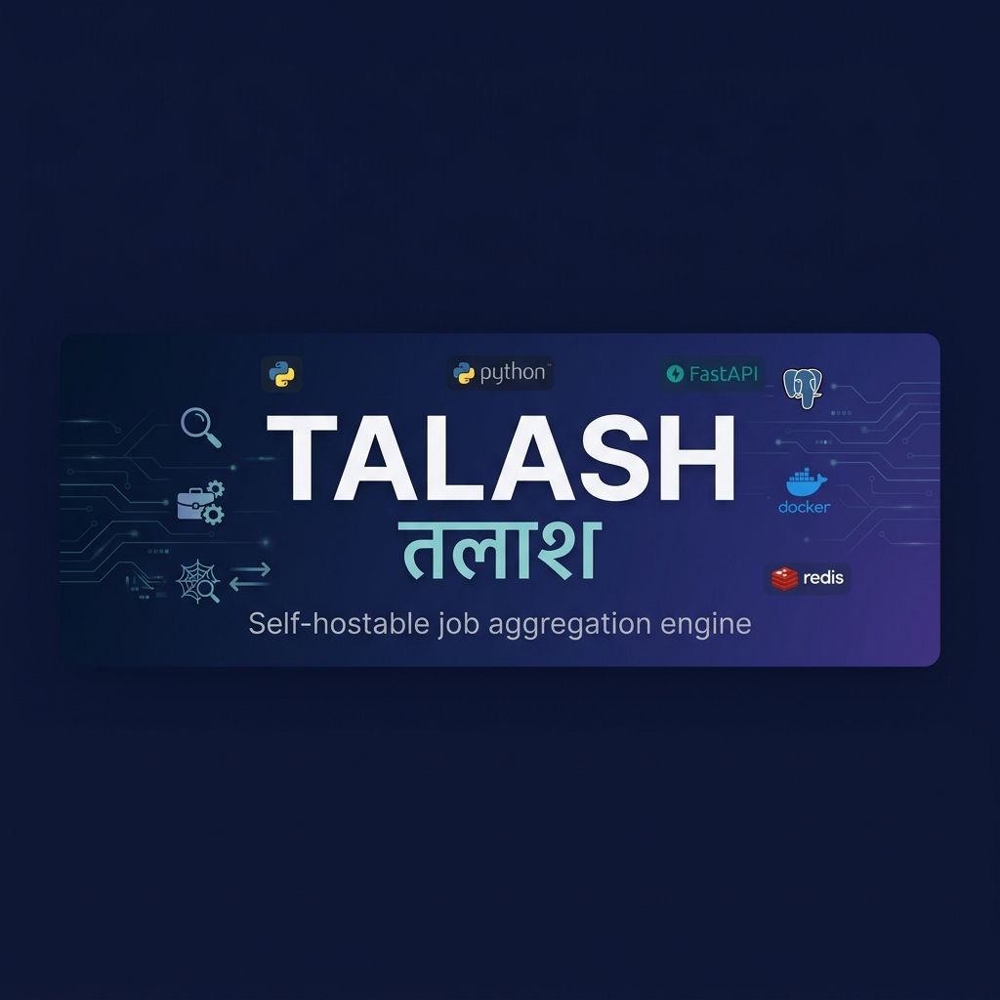

<p align="center">
  
</p>

<p align="center">
  <strong>तलाश (talāsh)</strong> — <em>Hindi for "search"</em>
</p>

<p align="center">
  <a href="https://www.python.org/downloads/"></a>
  <a href="https://github.com/iamrahulroyy/talash/actions/workflows/ci.yml"></a>
  <a href="LICENSE"></a>
  <a href="https://github.com/iamrahulroyy/talash/stargazers"></a>
</p>

<p align="center">
  The open-source job aggregation engine.<br>
  Crawls remote-first boards in parallel, normalizes everything into a single schema,<br>
  dedupes reposts with SimHash, and serves blazing-fast Postgres full-text search<br>
  behind a clean FastAPI + minimal UI.
</p>

<p align="center">
  <code>FastAPI</code> · <code>SQLAlchemy 2.0 async</code> · <code>PostgreSQL FTS</code> · <code>Celery + Redis</code> · <code>Docker Compose</code> · <code>SimHash dedup</code> · <code>Pluggable crawlers</code>
</p>

---

## Why Talash?

Existing job boards are walled gardens, slow, and full of reposts. Talash is
a **self-hostable, developer-first** alternative:

- 🔌 **Add a new source in ~40 lines of Python.**
- 🧬 Near-duplicate listings across boards collapse automatically via **64-bit SimHash**.
- 🔍 Search is **Postgres native** (tsvector + GIN + weighted rank + recency decay) —
  no Elasticsearch cluster needed until you actually have one.
- ⚡ Async crawlers, async API, async SQLAlchemy — the whole stack breathes.
- 🐳 Everything runs on `docker compose up`.

---

## Architecture

```text
               ┌──────────────┐
               │  Celery beat │  cron: every 30 min / source
               └──────┬───────┘
                      │ enqueue
                      ▼
  ┌────────────┐   ┌──────────┐   ┌──────────────────────────┐
  │  Crawlers  │◀──│  Redis   │──▶│  Celery worker (asyncio) │
  │  RemoteOK  │   └──────────┘   │  fetch → normalize →     │
  │  WWR RSS   │                  │  SimHash dedup → upsert  │
  └────────────┘                  └──────────────┬───────────┘
                                                 │
                                          ┌──────▼──────┐
                                          │  Postgres   │  tsvector + GIN
                                          └──────┬──────┘
                                                 │
                                 ┌───────────────▼───────────────┐
                                 │  FastAPI                       │
                                 │    GET  /search   (FTS + rank) │
                                 │    GET  /jobs/{id}             │
                                 │    POST /admin/crawl           │
                                 │    GET  /                      │  minimal UI
                                 └────────────────────────────────┘
```

- **Crawlers** are async generators yielding `NormalizedJob`. Adding a source
  means implementing `BaseCrawler.fetch()` and registering the instance.
- **Dedup** — 64-bit SimHash over `(title, company, first N words of description)`.
  Exact `(source, source_id)` collisions upsert; near matches (Hamming ≤ threshold)
  against any existing job are dropped.
- **Ranking (Postgres)**:
  `ts_rank_cd + title-match boost + exp(-age_days / 14)` — half-life ≈ 14 days.
  The search layer is isolated in `app/services/search.py`, so swapping in
  Elasticsearch later requires no change to ingest.

---

## ✅ Features

### Crawling & ingestion

- Async `BaseCrawler` with shared HTTPX client, per-source concurrency
  semaphore, and 3-attempt exponential backoff.
- RemoteOK crawler (public JSON feed).
- We Work Remotely crawler (5 category RSS feeds).
- Pluggable crawler registry — one entry point to add a new source.
- Normalization: HTML stripping (selectolax), whitespace squishing,
  salary regex with `$`/`k`/comma-aware parsing, experience level inference
  (junior/mid/senior), timezone-aware `posted_at`, remote/anywhere detection.
- 64-bit SimHash near-duplicate detection, stored as signed BIGINT
  (Postgres-compatible). Configurable Hamming threshold.
- Upsert on `(source, source_id)` — crawlers can be re-run safely.
- Ingest stats (`received / inserted / updated / duplicates`).

### API & search

- `GET /search` — free text + filters + pagination. Supports quoted
  phrases, `AND` / `OR`, and `-` negation via `websearch_to_tsquery`.
- `GET /jobs/{id}` — single job detail with 404.
- `GET /admin/sources` — list registered crawlers.
- `POST /admin/crawl` — trigger one or all crawlers.
- `GET /healthz` — liveness probe.
- OpenAPI + Swagger UI at `/docs`.
- Ranked search: relevance + title-boost + recency decay (14-day half-life).
- Pagination with `page_size` clamped to 100.

### Scheduling & infrastructure

- Celery worker + Celery beat for automated every-30-min crawls per source.
- Task retries (max 3, `acks_late`, `reject_on_worker_lost`).
- Idempotent schema bootstrap — no Alembic required for MVP.
- Postgres trigger that maintains a weighted tsvector
  (title=A, company=B, tags=B, location=C, description=D).
- Full `docker-compose.yml`: Postgres + Redis + API + worker + beat.
- Dev task runner via `uv` + `taskipy`.

### Frontend

- Minimal zero-build single-page UI (static HTML/CSS/JS) with live search,
  filters (location, remote, experience), and pagination.

### Developer experience

- **160-test** production suite covering unit / integration / edge cases
  (see [Test suite](#-test-suite)).
- Ruff lint + format.
- SQLite-compatible models so tests run without Postgres.
- GitHub Actions CI (lint + test on every push).

---

## 🚀 Quickstart

### Docker (recommended)

```bash
git clone https://github.com/iamrahulroyy/talash.git
cd talash
cp .env.example .env
docker compose up --build
```

- **UI**: http://localhost:8000/
- **API docs**: http://localhost:8000/docs
- **Trigger a crawl**:

  ```bash
  curl -X POST http://localhost:8000/admin/crawl \
       -H 'content-type: application/json' -d '{}'
  ```

Celery beat fires crawls every 30 minutes automatically.

### Local (no Docker)

Dependencies and tasks are managed with [uv](https://docs.astral.sh/uv/) and
[taskipy](https://github.com/taskipy/taskipy). Postgres 14+ and Redis 7+ must
be reachable.

```bash
uv sync
cp .env.example .env    # edit DATABASE_URL / REDIS_URL if needed

uv run task api         # terminal 1 — FastAPI
uv run task worker      # terminal 2 — Celery worker
uv run task beat        # terminal 3 — Celery beat (optional)
```

---

## 🛠️ Dev tasks

| Command              | What it does                                |
|----------------------|---------------------------------------------|
| `uv run task api`    | FastAPI dev server (`uvicorn --reload`)      |
| `uv run task worker` | Celery worker                               |
| `uv run task beat`   | Celery beat scheduler                       |
| `uv run task test`   | `pytest -q`                                 |
| `uv run task lint`   | `ruff check`                                |
| `uv run task fmt`    | `ruff format`                               |
| `uv run task up`     | `docker compose up --build`                 |
| `uv run task down`   | `docker compose down`                       |
| `uv run task crawl`  | POST `/admin/crawl` to trigger all crawlers |

---

## 📡 API

### `GET /search`

| Name         | Type    | Notes                                         |
|--------------|---------|-----------------------------------------------|
| `q`          | string  | free text; supports `"phrase"`, `AND/OR`, `-` |
| `location`   | string  | substring match                               |
| `remote`     | bool    | `true` / `false`                              |
| `experience` | enum    | `junior` \| `mid` \| `senior`                 |
| `company`    | string  | substring match                               |
| `source`     | string  | e.g. `remoteok`, `weworkremotely`             |
| `page`       | int     | default 1                                     |
| `page_size`  | int     | default 20, max 100                           |

```json
{
  "total": 42,
  "page": 1,
  "page_size": 20,
  "results": [ { "id": 1, "title": "…", "company": "…", "...": "..." } ]
}
```

### `POST /admin/crawl`

```json
{ "source": "remoteok" }   // specific source
{}                          // all registered sources
```

Returns `{ "dispatched": ["remoteok", ...] }`.

### `GET /admin/sources`

Returns `{ "sources": ["remoteok", "weworkremotely"] }`.

---

## 🔌 Adding a new source

This is the best way to contribute! Each crawler is ~40 lines:

1. Create `app/crawlers/<name>.py` subclassing `BaseCrawler` with `name = "<source>"`.
2. Implement `async def fetch(self) -> AsyncIterator[NormalizedJob]`.
3. Register an instance in `app/crawlers/__init__.py`.
4. Add a beat schedule entry in `app/workers/celery_app.py` if you want cron.
5. Write a crawler test modelled on `tests/test_crawlers.py` (fake the HTTP
   client via monkeypatch on `_client()` — never hit the real network in tests).

---

## 🧪 Test suite

A **160-test** production suite runs on SQLite in under a second:

| Area           | File                         | Highlights                                                           |
|----------------|------------------------------|----------------------------------------------------------------------|
| Normalization  | `test_normalize*.py`         | HTML / unicode / malformed / salary edges / tz / inference           |
| Dedup          | `test_dedup*.py`             | signed/unsigned BIGINT round-trip · threshold sweeps · DB prefilter  |
| Crawlers       | `test_crawlers*.py`          | parsing · missing fields · bad dates · single-feed failure isolation |
| Base crawler   | `test_crawlers_edge.py`      | retry-then-succeed · give-up after 3 · semaphore concurrency cap     |
| Ingest         | `test_ingest*.py`            | upsert · tags storage · signed-BIGINT simhash · threshold sweeps     |
| Search         | `test_search.py`             | filter combinations · pagination boundaries · recency order          |
| API            | `test_api.py`                | validation · envelope · 404s · admin dispatch mocking · OpenAPI      |
| Workers        | `test_workers.py`            | `_run_crawler` happy/empty/error · retry glue · beat schedule        |
| Schemas+config | `test_schemas_and_config.py` | Pydantic validation · env var overrides                              |

```bash
uv run task test
# or
uv run pytest -q
```

Postgres-only paths (tsvector, `ts_rank_cd`, the search-vector trigger) are
validated by the docker-compose integration stack, not by unit tests.

---

## 🗺️ Roadmap

<details>
<summary><strong>Phase 1 — Hardening</strong> (next)</summary>

- 🛠️ API key / JWT auth on `/admin/*` endpoints
- 🛠️ Rate limiting (slowapi or reverse-proxy based)
- 🛠️ Structured logging (structlog + request IDs)
- 🛠️ Prometheus `/metrics` endpoint
- 🛠️ Alembic migrations alongside the idempotent bootstrap
- 🛠️ Pre-commit hooks (ruff + mypy)

</details>

<details>
<summary><strong>Phase 2 — More sources</strong></summary>

- 🛠️ Hacker News "Who's Hiring" monthly scrape
- 🛠️ Wellfound / AngelList public listings
- 🛠️ Lever / Greenhouse / Workable job-board APIs
- 🛠️ Generic career-page scraper with per-company selector configs
- 🛠️ Robots.txt + Crawl-Delay honouring per source

</details>

<details>
<summary><strong>Phase 3 — Better search</strong></summary>

- 🛠️ Hybrid BM25 + semantic embeddings (pgvector) for "jobs like this one"
- 🛠️ Skill / tech-stack facets (extracted from description at ingest)
- 🛠️ Salary normalization to annual USD + purchasing-power overlay
- 🛠️ Company enrichment (size, sector, Glassdoor-style metadata)
- 🛠️ Location geocoding + radius search
- 🛠️ Saved searches → email / RSS / webhook alerts

</details>

<details>
<summary><strong>Phase 4 — User-facing product</strong></summary>

- 🛠️ User accounts, application tracker, kanban board
- 🛠️ Resume-aware recommendations (embed once, rank on query)
- 🛠️ "Hide company" / "hide keyword" personal blocklists
- 🛠️ Browser extension: one-click save from any source page
- 🛠️ Public Next.js front-end replacing the static MVP UI

</details>

<details>
<summary><strong>Phase 5 — Scale</strong></summary>

- 🛠️ Drop-in Elasticsearch / OpenSearch backend
- 🛠️ MinHash LSH index replacing in-memory SimHash for 10M+ listings
- 🛠️ Distributed crawl coordinator (Celery → Temporal or Arq)
- 🛠️ Read replicas + connection pooler (pgbouncer)
- 🛠️ S3 archival of raw crawl payloads for replay / re-normalization
- 🛠️ Public dataset + BigQuery export

</details>

<details>
<summary><strong>Phase 6 — Community</strong></summary>

- 🛠️ Public demo at `demo.talash.dev`
- 🛠️ Plugin marketplace for community crawlers
- 🛠️ Contributor guide + issue templates + governance doc

</details>

---

## 🚫 What's deliberately out of scope (for now)

- Per-company career-page scraping (each site is bespoke — Phase 2).
- User accounts / saved searches / alerts (Phase 4).
- Elasticsearch (Phase 5 — Postgres FTS is enough for low millions).
- Robots.txt / rate-limit negotiation (current sources expose public feeds
  intended for programmatic use; general scraping needs this in Phase 2).

---

## 🤝 Contributing

PRs welcome! Please read the [Contributing Guide](CONTRIBUTING.md) first.

Quick version:

- Run `uv run task lint` and `uv run task test` before pushing.
- Never commit `.env` or anything derived from a live database.
- Include a test for every crawler added — `_client()` must be monkeypatched.

---

## 📄 License

[MIT](LICENSE)

---

<p align="center">
  <strong>If Talash helped you, consider giving it a ⭐</strong><br>
  <em>It helps others discover the project!</em>
</p>
